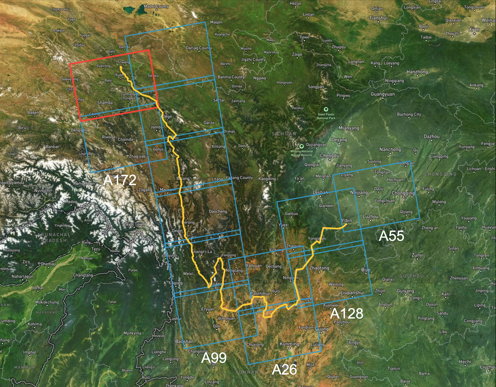
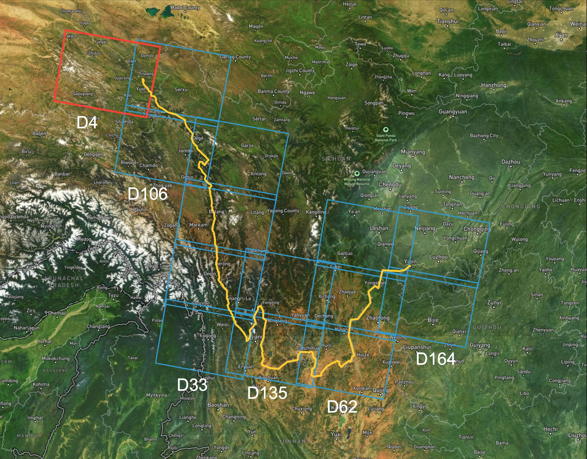
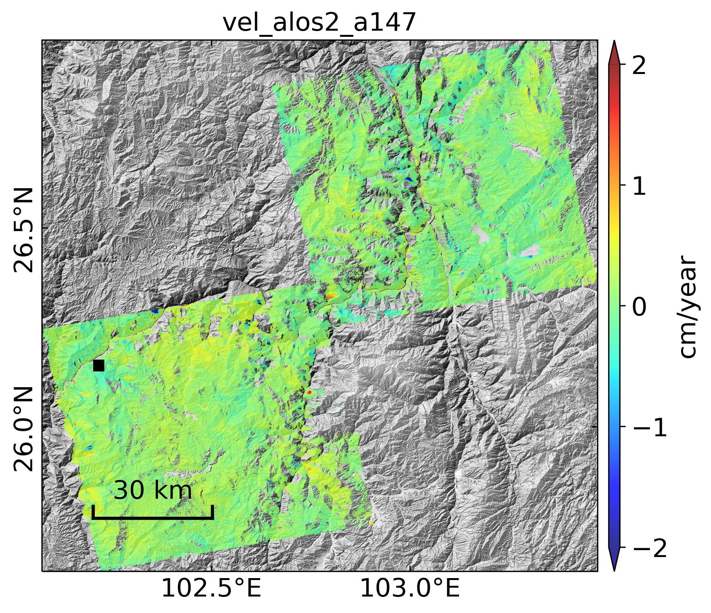

## SAR data over the Jinsha River Basin

### Data

+ Area of interest in WKT: [JinshaRiver.wkt](JinshaRiver.wkt)
+ Data information: [SAR.csv](SAR.csv)

#### Sentinel-1

+ Search and download from ASF: https://search.asf.alaska.edu/

| Ascending orbits            | Descending orbits           |
| --------------------------- | --------------------------- |
|  |  |

#### ALOS-2

+ Search on G-Portal: https://gportal.jaxa.jp/gpr/

  

